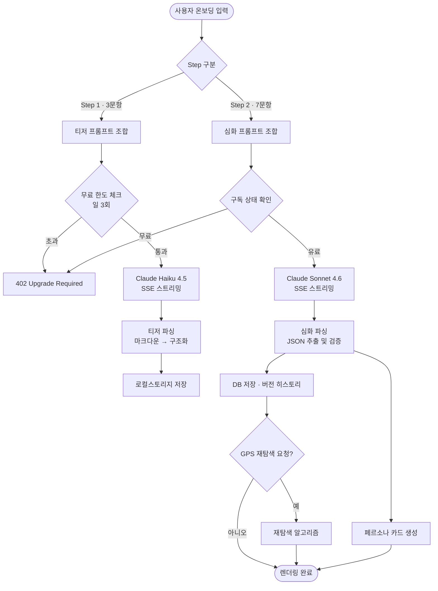
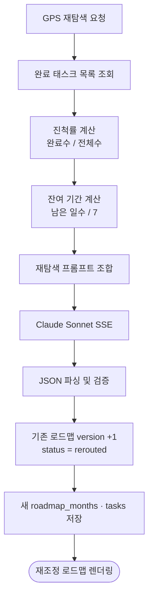

# CareerPath — 알고리즘 명세서

> AI 로드맵 생성 · GPS 재탐색 · 페르소나 카드 | v1.2 기준 | 2026.03

---

## 1. 전체 흐름도



---

## 2. 알고리즘 A — 프롬프트 조합

### 입력 정규화 상수

```python
ROLE_MAP = {
    "backend":      "백엔드 개발자",
    "frontend":     "프론트엔드 개발자",
    "cloud_devops": "클라우드/DevOps 엔지니어",
    "fullstack":    "풀스택 개발자",
    "data":         "데이터 엔지니어/분석가",
    "ai_ml":        "AI/ML 엔지니어",
    "security":     "보안 엔지니어",
    "ios_android":  "모바일(iOS/Android) 개발자",
    "qa":           "QA 엔지니어",
}

PERIOD_MAP = {
    "3months":    3,
    "6months":    6,
    "1year":     12,
    "1year_plus": 18,
}

TASKS_PER_WEEK = {
    "under1h": 2,
    "1to2h":   3,
    "3to4h":   5,
    "over5h":  7,
}
```

### 티저 프롬프트 템플릿 (Step 1 · Haiku)

```
[SYSTEM]
당신은 IT 취업 전문 커리어 코치입니다.
사용자 정보를 바탕으로 학습 로드맵의 뼈대(티저)를 생성하세요.
- 응답은 반드시 한국어로 작성
- 월별 핵심 주제만 나열 (세부 태스크 제외)
- 각 월은 "## {n}월차: {테마}" 형식
- 전체 500자 이내

[USER]
목표 직군: {role}
목표 기간: {period}개월
현재 수준: {level}
```

### 심화 프롬프트 템플릿 (Step 2 · Sonnet)

```
[SYSTEM]
당신은 IT 취업 전문 커리어 코치입니다.
아래 사용자 정보를 기반으로 상세한 월별 학습 로드맵을 JSON으로 생성하세요.

출력 형식 (JSON만 출력, 설명 없음):
{
  "summary": "한 줄 요약",
  "persona_title": "MBTI 스타일 유형명",
  "persona_subtitle": "한 줄 설명",
  "months": [
    {
      "month": 1,
      "theme": "월차 테마",
      "weeks": [
        {
          "week": 1,
          "tasks": [
            { "content": "태스크 내용", "category": "learn|project|cert" }
          ]
        }
      ]
    }
  ]
}

규칙:
- 보유 스킬은 건너뛰고 부족한 부분에 집중
- 목표 회사 유형에 맞는 기술 스택 강조
- 하루 학습 시간에 비례해 주당 태스크 수 조절
- 한국 시장 특화: 관련 자격증 취득 일정 포함
- 마지막 달은 항상 포트폴리오 완성 + 지원 실행

[USER]
목표 직군: {role}
목표 기간: {period}개월
현재 수준: {level}
보유 스킬: {skills}
보유 자격증: {certifications}
목표 회사: {company_type}
하루 학습 시간: {daily_hours}
```

---

## 3. 알고리즘 B — 응답 파싱

### 티저 파싱 (마크다운 → 구조)

```python
import re

def parse_teaser(raw_text: str) -> list[dict]:
    """
    '## 1월차: 기초 다지기' 패턴 파싱
    """
    pattern = r"##\s*(\d+)월차[:\s]+(.+)"
    months = []
    for match in re.finditer(pattern, raw_text):
        months.append({
            "month": int(match.group(1)),
            "theme": match.group(2).strip()
        })
    return months
```

### 심화 로드맵 파싱 (JSON 추출)

```python
import json, re

def parse_full_roadmap(raw_text: str) -> dict:
    # 코드블록 제거
    cleaned = re.sub(r"```json\s*|\s*```", "", raw_text).strip()

    try:
        data = json.loads(cleaned)
    except json.JSONDecodeError:
        # JSON 블록만 추출 (첫 { ... } 쌍)
        match = re.search(r"\{.*\}", cleaned, re.DOTALL)
        if not match:
            raise ValueError("유효한 JSON을 찾을 수 없습니다")
        data = json.loads(match.group())

    # 필수 필드 검증
    required = {"summary", "persona_title", "months"}
    if not required.issubset(data.keys()):
        raise ValueError(f"필수 필드 누락: {required - data.keys()}")

    return data


def validate_and_normalize(data: dict, expected_months: int) -> dict:
    months = data.get("months", [])
    months = months[:expected_months]           # 초과 월 제거

    while len(months) < expected_months:        # 부족 시 빈 월 추가
        n = len(months) + 1
        months.append({"month": n, "theme": f"{n}월차 학습", "weeks": []})

    data["months"] = months
    return data
```

---

## 4. 알고리즘 C — 무료 사용자 일일 한도 체크

```python
async def check_and_increment_daily_limit(
    db: Client,
    user_id: str,
    limit: int = 3
) -> tuple[bool, int]:
    """
    Returns: (allowed: bool, current_count: int)
    UPDATE ... RETURNING 단일 쿼리로 원자적 처리
    """
    result = db.rpc("check_daily_limit", {
        "p_user_id": user_id,
        "p_limit": limit
    }).execute()

    row = result.data[0]
    return row["allowed"], row["count"]
```

Supabase RPC 함수:

```sql
CREATE OR REPLACE FUNCTION check_daily_limit(p_user_id uuid, p_limit int)
RETURNS TABLE(allowed boolean, count int) AS $$
BEGIN
  UPDATE users SET
    daily_generation_count = CASE
      WHEN daily_reset_date < CURRENT_DATE THEN 1
      ELSE daily_generation_count + 1
    END,
    daily_reset_date = CURRENT_DATE
  WHERE id = p_user_id
    AND (daily_reset_date < CURRENT_DATE OR daily_generation_count < p_limit);

  RETURN QUERY
    SELECT (found), daily_generation_count
    FROM users WHERE id = p_user_id;
END;
$$ LANGUAGE plpgsql;
```

---

## 5. 알고리즘 D — GPS 재탐색

### 재탐색 트리거 조건

```
OR 조건:
  1. 사용자가 "GPS 재탐색" 버튼 명시적 클릭
  2. 현재 주차 대비 완료율 < 50% (자동 감지 → 알림 표시)
  3. 목표 기간 변경 요청
```

### 재탐색 컨텍스트 계산

```python
from dataclasses import dataclass
from datetime import date

@dataclass
class RerouteInput:
    roadmap_id: str
    completed_task_ids: list[str]
    current_date: date
    original_deadline: date
    new_deadline: date | None

def calculate_reroute_context(inp: RerouteInput, all_tasks: list[dict]) -> dict:
    total = len(all_tasks)
    done = len(inp.completed_task_ids)
    done_contents = [t["content"] for t in all_tasks
                     if t["id"] in inp.completed_task_ids]

    deadline = inp.new_deadline or inp.original_deadline
    days_left = (deadline - inp.current_date).days
    weeks_left = max(1, days_left // 7)

    return {
        "completion_rate": round(done / total * 100, 1) if total else 0,
        "done_contents": done_contents,
        "remaining_count": total - done,
        "weeks_left": weeks_left,
    }
```

### 재탐색 흐름도



---

## 6. 알고리즘 E — 페르소나 카드 생성

### 데이터 출처

| 필드 | 출처 |
|---|---|
| `title` | Sonnet JSON의 `persona_title` |
| `subtitle` | Sonnet JSON의 `persona_subtitle` |
| `share_token` | DB INSERT 시 `substr(md5(random()), 1, 12)` 자동 생성 |

### 공유 URL

```
https://careerpath.kr/card/{share_token}
```

### OG 메타 태그

```html
<meta property="og:title" content="{persona_title}" />
<meta property="og:description" content="{persona_subtitle} — careerpath.kr" />
<meta property="og:image" content="https://careerpath.kr/og/{share_token}.png" />
<!-- MVP: 정적 템플릿 이미지 사용 / v2.0: 동적 OG 이미지 생성 -->
```

---

## 7. 알고리즘 F — 잔디 강도 계산

```python
def get_grass_level(completed_task_count: int) -> int:
    """하루 완료 태스크 수 → 잔디 강도 (0~4)"""
    if completed_task_count == 0: return 0   # 회색
    if completed_task_count <= 2: return 1   # 연보라
    if completed_task_count <= 4: return 2   # 보라
    if completed_task_count <= 7: return 3   # 진보라
    return 4                                  # 최고 강도
```

---

## 8. 오류 처리 전략

| 상황 | 처리 방법 |
|---|---|
| Claude API 타임아웃 (30s) | 부분 응답 저장 후 "재시도" 버튼 노출 |
| JSON 파싱 실패 | 최대 2회 재시도 → 실패 시 티저만 표시 |
| Supabase 연결 오류 | 로컬스토리지 fallback 후 온라인 복귀 시 동기화 |
| 무료 한도 초과 | 402 + 업그레이드 모달 (잔여 횟수 표시) |
| 구독 만료 후 접근 | 기존 로드맵 읽기 전용 유지, 재탐색만 차단 |
