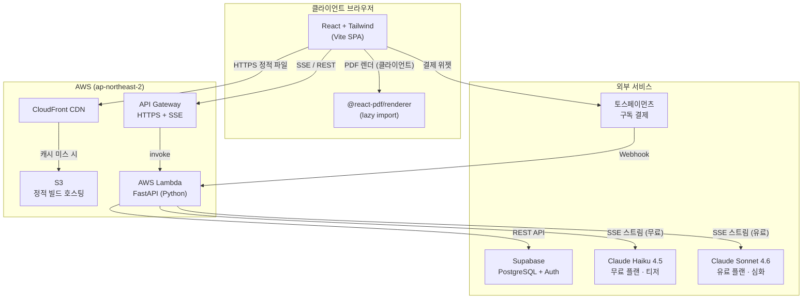
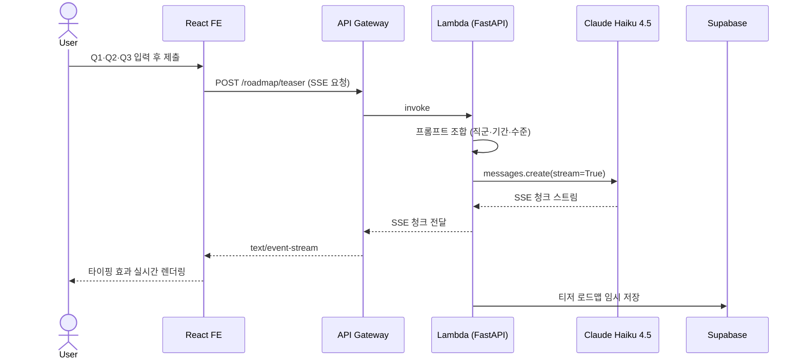
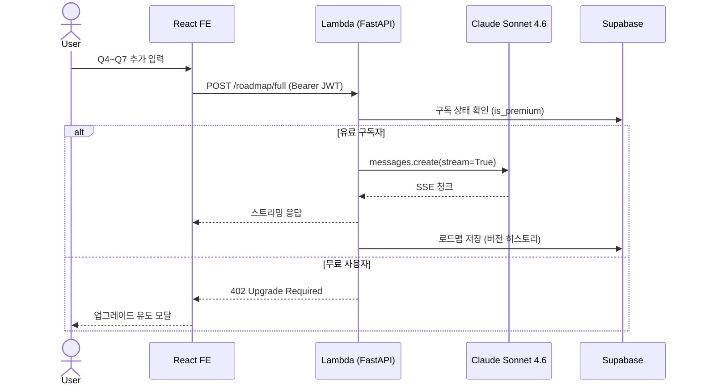
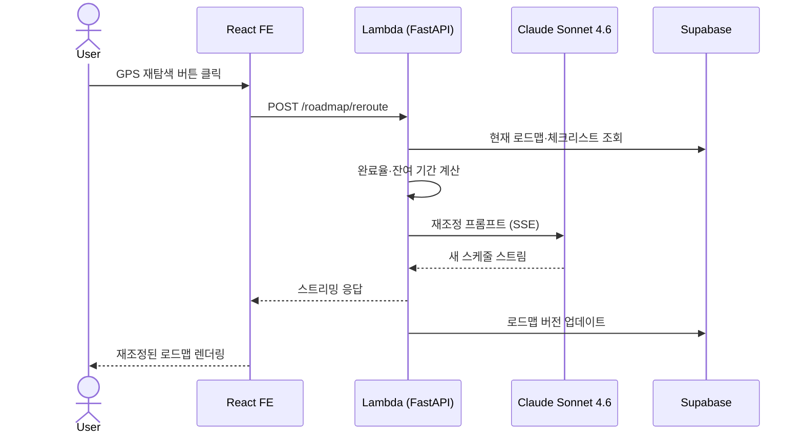
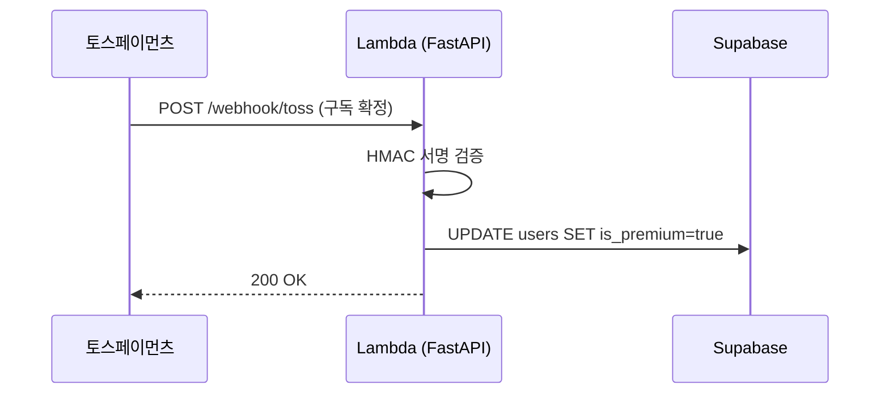
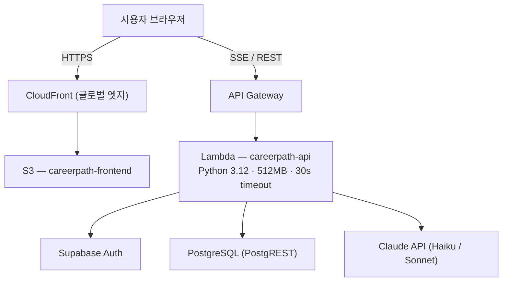

# CareerPath — 시스템 아키텍처 설계

> v1.2 기준 | 2026.03

---

## 1. Overview

CareerPath는 IT 직군 취준생이 7개 온보딩 질문에 답하면 Claude AI가 개인화된 월별 학습 로드맵을 즉시 생성해주는 웹 서비스다. 무료 사용자는 Claude Haiku로 티저 로드맵을, 유료 구독자는 Claude Sonnet으로 완전한 심화 로드맵을 제공한다.

**핵심 설계 목표:**
- **비용 최소화**: 서버리스(Lambda) + Supabase 무료 플랜으로 초기 월 비용 ~6,000원
- **체감 대기 0초**: SSE 스트리밍으로 AI 응답을 즉시 타이핑 효과로 렌더링
- **확장 가능성**: MAU 100 → 1만 구간을 인프라 교체 없이 수용

**범위 외 (v2.0 이관):**
- 채용 공고 크롤링 / FCM 알림
- Notion / Markdown 내보내기
- B2B 어필리에이트 자동화

---

## 2. 시스템 아키텍처 다이어그램

---

## 3. 컴포넌트 설명

| 컴포넌트 | 역할 | 기술 선택 이유 |
|---|---|---|
| **React + Tailwind** | SPA UI, SSE 수신, 상태 관리 | 기존 스택 활용, Vite로 빠른 빌드 |
| **S3 + CloudFront** | 정적 파일 전역 배포 | 월 ~1,000원, 포트폴리오 배포 경험 재활용 |
| **API Gateway** | HTTPS 엔드포인트, SSE 지원 | Lambda 앞단 관리형 게이트웨이 |
| **Lambda (FastAPI)** | AI 호출·DB 저장·구독 분기 | 서버리스로 유휴 비용 0원, Python 숙련도 |
| **Supabase** | PostgreSQL DB + Auth | Lambda 커넥션 풀 고갈 방지(REST API 방식), 초기 0원 |
| **Claude Haiku 4.5** | 무료 티저 로드맵 생성 | 저비용·고속, Step 1 응답에 적합 |
| **Claude Sonnet 4.6** | 유료 심화 로드맵 생성 | 정교한 추론, 유료 차별화 핵심 |
| **토스페이먼츠** | 구독 결제·Webhook | 국내 PG, 포트원 경유 가입비 0원 |
| **@react-pdf/renderer** | PDF 다운로드 | 클라이언트 렌더링 → 서버 비용 0원 |

---

## 4. 핵심 시퀀스 다이어그램

### 4-1. Step 1 티저 생성 (SSE 스트리밍)

### 4-2. Step 2 심화 로드맵 생성 (유료)

### 4-3. GPS 재탐색

### 4-4. 결제 Webhook

---

## 5. 배포 토폴로지

---

## 6. 오픈 이슈

| 항목 | 비고 |
|---|---|
| Lambda SSE 지원 | API Gateway HTTP API + Lambda Response Streaming 조합 필요 |
| Supabase RLS | 사용자별 로드맵 격리 필수 |
| Claude API Rate Limit | 무료 사용자 일일 3회 제한으로 급증 방어 |
| 토스페이먼츠 사업자 등록 | M5 착수 전 신청 (처리 약 1주) |
