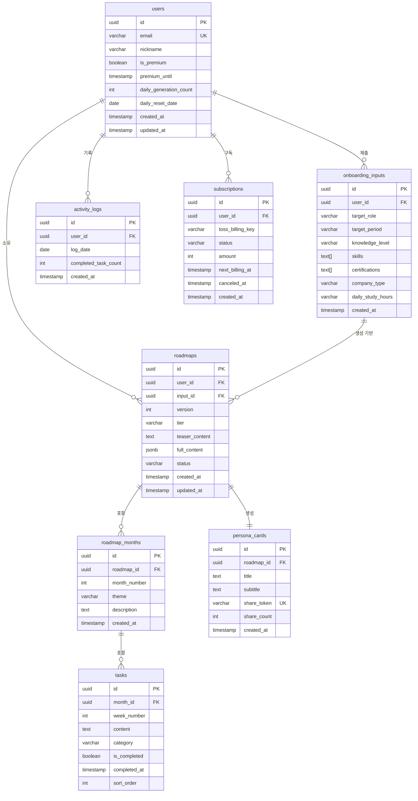

# CareerPath — DB 테이블 명세서

> Supabase PostgreSQL 기반 | v1.2 기준 | 2026.03

---

## 1. ERD



---

## 2. 테이블 DDL

### users

```sql
CREATE TABLE users (
  id                    UUID PRIMARY KEY DEFAULT gen_random_uuid(),
  email                 VARCHAR(255) NOT NULL UNIQUE,
  nickname              VARCHAR(50),
  is_premium            BOOLEAN NOT NULL DEFAULT false,
  premium_until         TIMESTAMPTZ,
  daily_generation_count INT NOT NULL DEFAULT 0,   -- 무료 사용자 일일 생성 횟수 (최대 3회)
  daily_reset_date      DATE NOT NULL DEFAULT CURRENT_DATE,
  created_at            TIMESTAMPTZ NOT NULL DEFAULT now(),
  updated_at            TIMESTAMPTZ NOT NULL DEFAULT now()
);

CREATE INDEX idx_users_email ON users(email);
CREATE INDEX idx_users_premium ON users(is_premium, premium_until);

ALTER TABLE users ENABLE ROW LEVEL SECURITY;
CREATE POLICY "users_self_only" ON users USING (auth.uid() = id);
```

### onboarding_inputs

```sql
CREATE TABLE onboarding_inputs (
  id                UUID PRIMARY KEY DEFAULT gen_random_uuid(),
  user_id           UUID NOT NULL REFERENCES users(id) ON DELETE CASCADE,
  target_role       VARCHAR(50) NOT NULL,
  -- 'backend' | 'frontend' | 'cloud_devops' | 'fullstack' | 'data' | 'ai_ml' | 'security' | 'ios_android' | 'qa'
  target_period     VARCHAR(20) NOT NULL,
  -- '3months' | '6months' | '1year' | '1year_plus'
  knowledge_level   VARCHAR(30) NOT NULL,
  -- 'beginner' | 'basic' | 'some_exp' | 'career_change'
  skills            TEXT[] NOT NULL DEFAULT '{}',
  certifications    TEXT[] NOT NULL DEFAULT '{}',
  company_type      VARCHAR(30),
  -- 'startup' | 'msp' | 'bigco' | 'si' | 'foreign' | 'any'
  daily_study_hours VARCHAR(20) NOT NULL,
  -- 'under1h' | '1to2h' | '3to4h' | 'over5h'
  created_at        TIMESTAMPTZ NOT NULL DEFAULT now()
);

CREATE INDEX idx_onboarding_user ON onboarding_inputs(user_id, created_at DESC);

ALTER TABLE onboarding_inputs ENABLE ROW LEVEL SECURITY;
CREATE POLICY "onboarding_owner" ON onboarding_inputs USING (auth.uid() = user_id);
```

### roadmaps

```sql
CREATE TABLE roadmaps (
  id              UUID PRIMARY KEY DEFAULT gen_random_uuid(),
  user_id         UUID NOT NULL REFERENCES users(id) ON DELETE CASCADE,
  input_id        UUID NOT NULL REFERENCES onboarding_inputs(id),
  version         INT NOT NULL DEFAULT 1,           -- GPS 재탐색 시 +1
  tier            VARCHAR(10) NOT NULL,             -- 'free' | 'premium'
  teaser_content  TEXT,                             -- Haiku 생성 티저 (마크다운)
  full_content    JSONB,                            -- Sonnet 생성 전체 구조
  status          VARCHAR(20) NOT NULL DEFAULT 'active',
  -- 'active' | 'archived' | 'rerouted'
  created_at      TIMESTAMPTZ NOT NULL DEFAULT now(),
  updated_at      TIMESTAMPTZ NOT NULL DEFAULT now()
);

CREATE INDEX idx_roadmaps_user ON roadmaps(user_id, created_at DESC);
CREATE INDEX idx_roadmaps_status ON roadmaps(user_id, status);

ALTER TABLE roadmaps ENABLE ROW LEVEL SECURITY;
CREATE POLICY "roadmaps_owner" ON roadmaps USING (auth.uid() = user_id);
```

### roadmap_months

```sql
CREATE TABLE roadmap_months (
  id            UUID PRIMARY KEY DEFAULT gen_random_uuid(),
  roadmap_id    UUID NOT NULL REFERENCES roadmaps(id) ON DELETE CASCADE,
  month_number  INT NOT NULL,
  theme         VARCHAR(100) NOT NULL,
  description   TEXT,
  created_at    TIMESTAMPTZ NOT NULL DEFAULT now(),
  UNIQUE (roadmap_id, month_number)
);

CREATE INDEX idx_months_roadmap ON roadmap_months(roadmap_id, month_number);

ALTER TABLE roadmap_months ENABLE ROW LEVEL SECURITY;
CREATE POLICY "months_owner" ON roadmap_months
  USING (
    EXISTS (
      SELECT 1 FROM roadmaps r
      WHERE r.id = roadmap_id AND r.user_id = auth.uid()
    )
  );
```

### tasks

```sql
CREATE TABLE tasks (
  id            UUID PRIMARY KEY DEFAULT gen_random_uuid(),
  month_id      UUID NOT NULL REFERENCES roadmap_months(id) ON DELETE CASCADE,
  week_number   INT NOT NULL,            -- 1~4
  content       TEXT NOT NULL,
  category      VARCHAR(20) NOT NULL,   -- 'learn' | 'project' | 'cert'
  is_completed  BOOLEAN NOT NULL DEFAULT false,
  completed_at  TIMESTAMPTZ,
  sort_order    INT NOT NULL DEFAULT 0,
  created_at    TIMESTAMPTZ NOT NULL DEFAULT now()
);

CREATE INDEX idx_tasks_month ON tasks(month_id, week_number, sort_order);
CREATE INDEX idx_tasks_completed ON tasks(month_id, is_completed);

ALTER TABLE tasks ENABLE ROW LEVEL SECURITY;
CREATE POLICY "tasks_owner" ON tasks
  USING (
    EXISTS (
      SELECT 1
      FROM roadmap_months rm
      JOIN roadmaps r ON r.id = rm.roadmap_id
      WHERE rm.id = month_id AND r.user_id = auth.uid()
    )
  );
```

### activity_logs

```sql
CREATE TABLE activity_logs (
  id                   UUID PRIMARY KEY DEFAULT gen_random_uuid(),
  user_id              UUID NOT NULL REFERENCES users(id) ON DELETE CASCADE,
  log_date             DATE NOT NULL,
  completed_task_count INT NOT NULL DEFAULT 0,
  created_at           TIMESTAMPTZ NOT NULL DEFAULT now(),
  UNIQUE (user_id, log_date)
);

CREATE INDEX idx_activity_user_date ON activity_logs(user_id, log_date DESC);

ALTER TABLE activity_logs ENABLE ROW LEVEL SECURITY;
CREATE POLICY "activity_owner" ON activity_logs USING (auth.uid() = user_id);
```

### persona_cards

```sql
CREATE TABLE persona_cards (
  id           UUID PRIMARY KEY DEFAULT gen_random_uuid(),
  roadmap_id   UUID NOT NULL REFERENCES roadmaps(id) ON DELETE CASCADE,
  title        TEXT NOT NULL,
  subtitle     TEXT,
  share_token  VARCHAR(12) NOT NULL UNIQUE
                 DEFAULT substr(md5(random()::text), 1, 12),
  share_count  INT NOT NULL DEFAULT 0,
  created_at   TIMESTAMPTZ NOT NULL DEFAULT now(),
  UNIQUE (roadmap_id)
);

CREATE INDEX idx_persona_token ON persona_cards(share_token);

ALTER TABLE persona_cards ENABLE ROW LEVEL SECURITY;
CREATE POLICY "persona_public_read" ON persona_cards
  FOR SELECT USING (true);
CREATE POLICY "persona_owner_write" ON persona_cards
  FOR ALL USING (
    EXISTS (
      SELECT 1 FROM roadmaps r
      WHERE r.id = roadmap_id AND r.user_id = auth.uid()
    )
  );
```

### subscriptions

```sql
CREATE TABLE subscriptions (
  id                UUID PRIMARY KEY DEFAULT gen_random_uuid(),
  user_id           UUID NOT NULL REFERENCES users(id) ON DELETE CASCADE,
  toss_billing_key  VARCHAR(255) NOT NULL,
  status            VARCHAR(20) NOT NULL,   -- 'active' | 'canceled' | 'past_due'
  amount            INT NOT NULL,           -- 990 또는 6900 (원)
  next_billing_at   TIMESTAMPTZ,
  canceled_at       TIMESTAMPTZ,
  created_at        TIMESTAMPTZ NOT NULL DEFAULT now()
);

CREATE INDEX idx_sub_user ON subscriptions(user_id, status);
CREATE INDEX idx_sub_billing ON subscriptions(next_billing_at)
  WHERE status = 'active';

ALTER TABLE subscriptions ENABLE ROW LEVEL SECURITY;
CREATE POLICY "sub_owner" ON subscriptions USING (auth.uid() = user_id);
```

---

## 3. 주요 쿼리 패턴

```sql
-- 잔디 대시보드: 최근 28일 활동 조회
SELECT log_date, completed_task_count
FROM activity_logs
WHERE user_id = $1
  AND log_date >= CURRENT_DATE - INTERVAL '27 days'
ORDER BY log_date;

-- 로드맵 진척도 계산
SELECT
  COUNT(*) FILTER (WHERE is_completed) AS done,
  COUNT(*) AS total
FROM tasks t
JOIN roadmap_months rm ON rm.id = t.month_id
WHERE rm.roadmap_id = $1;

-- 무료 사용자 일일 생성 횟수 원자적 체크 + 증가
UPDATE users SET
  daily_generation_count = CASE
    WHEN daily_reset_date < CURRENT_DATE THEN 1
    ELSE daily_generation_count + 1
  END,
  daily_reset_date = CURRENT_DATE
WHERE id = $1
  AND (daily_reset_date < CURRENT_DATE OR daily_generation_count < 3)
RETURNING daily_generation_count;

-- 태스크 완료 시 잔디 upsert
INSERT INTO activity_logs (user_id, log_date, completed_task_count)
VALUES ($1, CURRENT_DATE, 1)
ON CONFLICT (user_id, log_date)
DO UPDATE SET completed_task_count = activity_logs.completed_task_count + 1;
```

---

## 4. 인덱스 전략 요약

| 테이블 | 인덱스 컬럼 | 목적 |
|---|---|---|
| users | email | 로그인 조회 |
| users | is_premium, premium_until | 구독 상태 확인 |
| roadmaps | user_id, created_at DESC | 내 로드맵 목록 |
| tasks | month_id, is_completed | 체크리스트 필터링 |
| activity_logs | user_id, log_date DESC | 잔디 28일 조회 |
| persona_cards | share_token | 공유 링크 조회 |
| subscriptions | next_billing_at (active) | 결제 예정 스캔 |
