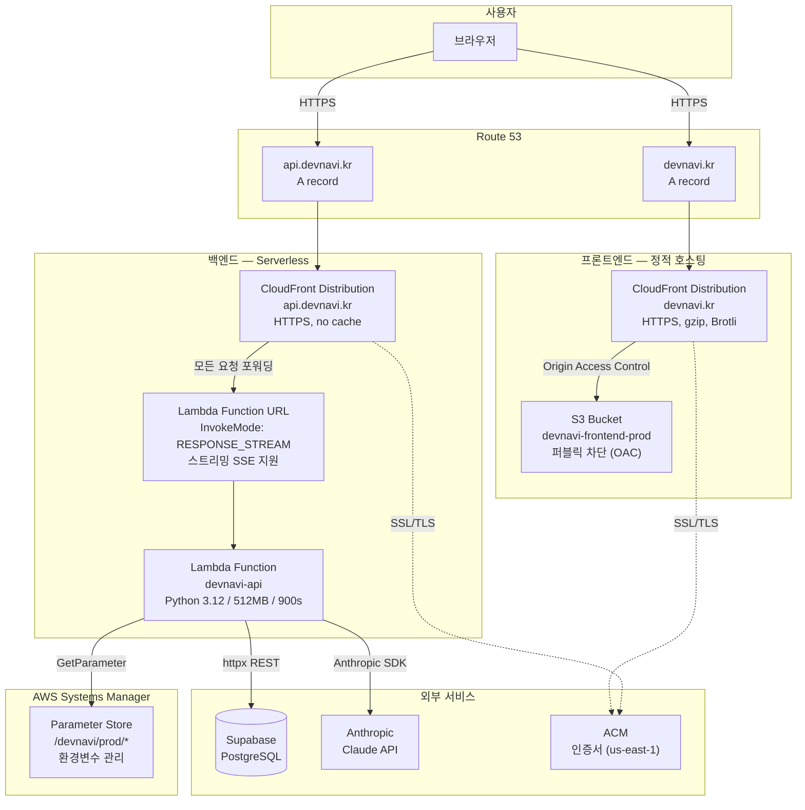
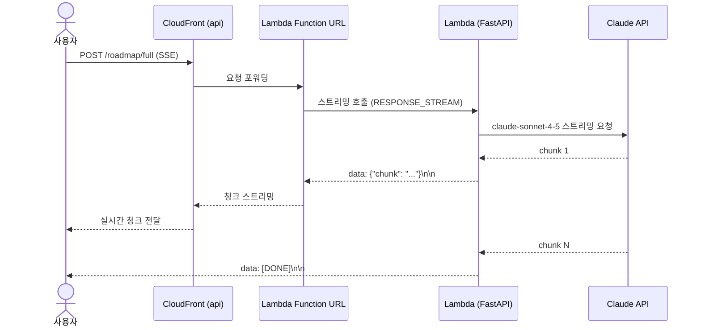
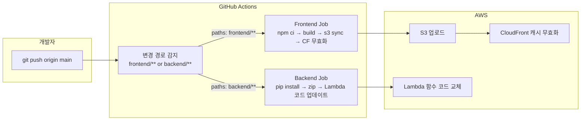

# DevNavi — AWS 배포 인프라 설계

## 1. Overview

DevNavi는 FastAPI 백엔드(Mangum/Lambda)와 React/Vite 프론트엔드로 구성된 AI 커리어 로드맵 서비스입니다.

**핵심 설계 목표:**
- 💰 비용 최소화 (초기 트래픽 기준 월 $3~10 목표)
- ⚡ SSE 스트리밍 완전 지원 (`/roadmap/full`, `/roadmap/reroute` — 응답 최대 60초)
- 🚀 GitHub Actions 자동 배포 (main 브랜치 푸시 시 무중단 배포)
- 🔒 환경변수 AWS Secrets Manager 관리

**Out of scope:** Multi-region, WAF, ElastiCache, VPC 구성 (트래픽 증가 시 Phase 2에서 추가)

---

## 2. 아키텍처 다이어그램



---

## 3. 컴포넌트 설명

### 프론트엔드

| 컴포넌트 | 역할 | 선택 이유 |
|---------|------|---------|
| **S3** | React 빌드 결과물 저장 | 정적 파일 호스팅 최저가 (~$0.023/GB) |
| **CloudFront** | CDN + HTTPS + 커스텀 도메인 | 엣지 캐싱으로 한국 사용자 응답속도 개선, S3 직접 노출 방지 |
| **ACM** | SSL 인증서 | 무료 자동 갱신 (us-east-1 필수) |
| **Route 53** | DNS | devnavi.kr → CloudFront Alias 레코드 |

**캐시 전략:**
- `index.html` → `Cache-Control: no-cache` (항상 최신 버전)
- `assets/*.js`, `assets/*.css` (해시 포함) → `Cache-Control: max-age=31536000` (1년)

### 백엔드

| 컴포넌트 | 역할 | 선택 이유 |
|---------|------|---------|
| **Lambda** | FastAPI 실행 | 트래픽 없으면 비용 $0, 최대 900초 타임아웃 |
| **Lambda Function URL** | HTTP 엔드포인트 | API Gateway 29초 타임아웃 제한 우회, SSE 스트리밍 지원 |
| **CloudFront (API)** | HTTPS + 커스텀 도메인 | Lambda Function URL에 커스텀 도메인 부착 |
| **SSM Parameter Store** | 환경변수 | 코드에 시크릿 하드코딩 방지 |

> **왜 API Gateway 대신 Lambda Function URL?**
> API Gateway HTTP API의 최대 타임아웃은 **29초**입니다.
> `/roadmap/full` SSE 스트리밍은 최대 60초 이상 소요되므로 API Gateway 사용 불가.
> Lambda Function URL은 최대 **900초(15분)** 타임아웃 + Response Streaming 지원.

---

## 4. SSE 스트리밍 흐름



---

## 5. CI/CD 파이프라인



---

## 6. AWS 리소스 목록

### 생성해야 할 리소스

| 리소스 | 이름 | 리전 | 비고 |
|--------|------|------|------|
| S3 Bucket | `devnavi-frontend-prod` | ap-northeast-2 | 퍼블릭 액세스 차단 |
| CloudFront Distribution | devnavi.kr | Global | OAC + S3 오리진 |
| CloudFront Distribution | api.devnavi.kr | Global | Lambda Function URL 오리진 |
| ACM Certificate | `*.devnavi.kr` | **us-east-1** (필수) | CloudFront용 |
| Lambda Function | `devnavi-api` | ap-northeast-2 | Python 3.12, 512MB, 900s |
| Lambda Function URL | - | ap-northeast-2 | InvokeMode: RESPONSE_STREAM |
| IAM Role | `devnavi-lambda-role` | - | SSM 읽기 권한 포함 |
| SSM Parameter | `/devnavi/prod/*` | ap-northeast-2 | SecureString |
| Route 53 | devnavi.kr | Global | Alias → CloudFront |
| IAM User | `devnavi-github-actions` | - | S3+CF+Lambda 권한만 |

### SSM Parameter Store 키 목록

```
/devnavi/prod/ANTHROPIC_API_KEY     (SecureString)
/devnavi/prod/SUPABASE_URL          (String)
/devnavi/prod/SUPABASE_SERVICE_KEY  (SecureString)
/devnavi/prod/SUPABASE_ANON_KEY     (SecureString)
/devnavi/prod/CORS_ORIGINS          (String) → ["https://devnavi.kr"]
/devnavi/prod/ENV                   (String) → production
```

---

## 7. 예상 비용 (월 기준)

| 서비스 | 예상 비용 | 비고 |
|--------|---------|------|
| Lambda | ~$0 | 월 100만 요청 무료 |
| CloudFront | ~$1 | 1TB 무료, 이후 $0.009/GB |
| S3 | ~$0.1 | 정적 파일 수백MB 수준 |
| ACM | $0 | 무료 |
| Route 53 | $0.5 | 호스팅 존 $0.50/월 |
| SSM Parameter Store | $0 | Standard tier 무료 |
| **합계** | **~$2~3/월** | 초기 트래픽 기준 |

---

## 8. IAM 최소 권한 정책

### Lambda 실행 역할 (`devnavi-lambda-role`)
```json
{
  "Version": "2012-10-17",
  "Statement": [
    {
      "Effect": "Allow",
      "Action": [
        "logs:CreateLogGroup",
        "logs:CreateLogStream",
        "logs:PutLogEvents"
      ],
      "Resource": "arn:aws:logs:ap-northeast-2:*:log-group:/aws/lambda/devnavi-api:*"
    },
    {
      "Effect": "Allow",
      "Action": ["ssm:GetParameter", "ssm:GetParameters"],
      "Resource": "arn:aws:ssm:ap-northeast-2:*:parameter/devnavi/prod/*"
    }
  ]
}
```

### GitHub Actions 배포 사용자 (`devnavi-github-actions`)
```json
{
  "Version": "2012-10-17",
  "Statement": [
    {
      "Effect": "Allow",
      "Action": ["s3:PutObject", "s3:DeleteObject", "s3:ListBucket"],
      "Resource": [
        "arn:aws:s3:::devnavi-frontend-prod",
        "arn:aws:s3:::devnavi-frontend-prod/*"
      ]
    },
    {
      "Effect": "Allow",
      "Action": ["cloudfront:CreateInvalidation"],
      "Resource": "*"
    },
    {
      "Effect": "Allow",
      "Action": ["lambda:UpdateFunctionCode"],
      "Resource": "arn:aws:lambda:ap-northeast-2:*:function:devnavi-api"
    }
  ]
}
```

---

## 9. Open Questions & Next Steps

| 항목 | 결정 필요 여부 | 비고 |
|------|-------------|------|
| devnavi.kr 도메인 구매 | ✅ 필수 (배포 전) | Route 53 또는 가비아/후이즈 |
| Lambda Cold Start 대응 | 선택 | Provisioned Concurrency ($) 또는 Ping Cron |
| Lambda 레이어 | 권장 | 의존성 패키지 분리 → 배포 속도 향상 |
| 모니터링 | 권장 | CloudWatch Logs + Alarm → 이메일 알림 |
| WAF | 배포 후 트래픽 보고 결정 | 월 $5+ 추가 비용 |
